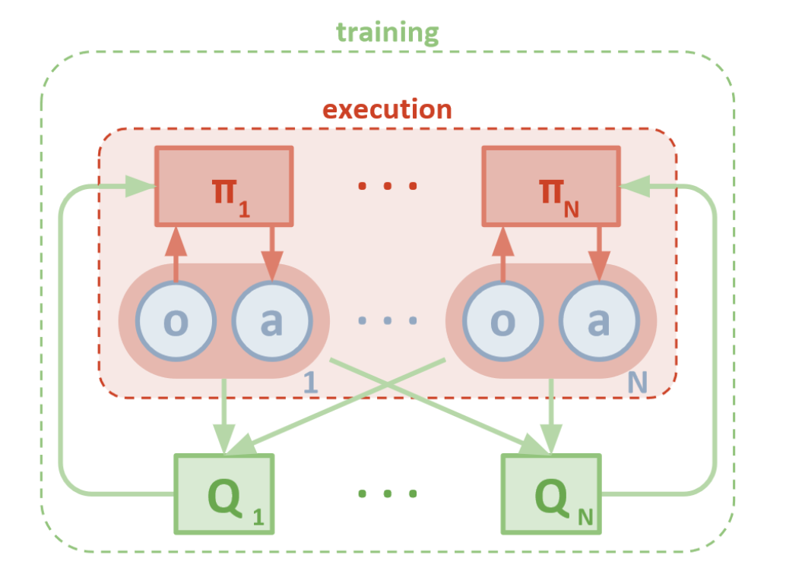

#  MADDPG implementation in PyTorch for the Unity Tennis environment

## Introduction

This implementation is based on a straight-forward Multi-Agent implementation of DDPG. We have two agents each with its own actor and critic (including the target networks for each) where each critic receives the combined state as well as combined actions.

## Implementation details

The modules are divided as follows:
 - `engine.py` contains the main Multi-Agent code including the creation of each individual agent actors and critics (online & target)
 - `agent.py` defines the basic behavior of individual agents without the actual training procedure
 - `brain.py` defines the graphs that are used for actors and critics
 - `ma_per.py` contains the replay buffer definition including the prioritized experience buffers (_work in progress_)
 - `OUNoise.py` contains the Ornstein–Uhlenbeck process noise generation class
 - `main.py` is the local version of the main code that can be used locally (without the Jupyter Notebook). Basically we have both the option of running locally the code with `main.py` as well as running the notebook `Tennis.ipynb`
 
The overall Multi-Agent DDPG approach follows the proposed approach from _[Multi-Agent Actor-Critic for Mixed Cooperative-Competitive Environments](https://arxiv.org/abs/1706.02275)_. Basically, each of the two agents optimize their online critics and then use the critic direct output to perform gradient descent in the inverse direction of the critic's output.

The training pseudo-code can be summarized as:
```
  for each agent:
    both agents target actors computes next_action
    curernt agent target critic generates next q-value
    using current agent reward compute TD-error
    optimize current agent critic
    compute next action for all actors 
    compute q-value with current agent critic (using all actions and states)
    minimize q-value return wrt current agent actor parameters
  for each agent:
    slowly transfer weights from online to target graphs
```
### The grid-search

In order to find optimal solution we performed multi-step grid-search. The first grid-search dictionary has been defined with the following self-explanatory parameters:

```
  dct_grid = {
      "actor_layers" : [ 
              [128, 128],
            ],
      "critic_state_layers" : [
            [128],
          ],
      "critic_final_layers" : [
            [128],
          ],
      "actor_input_bn" : [True, False],
      "actor_hidden_bn" : [True, False],
      "critic_state_bn" : [True, False],
      "critic_final_bn" : [True, False],
      "apply_post_bn"   : [True, False],
      "noise_scaling_factor" : [2, 1],
      }
```


>_*Important note*: the purpose of the grid-search was not to find a actual solution but to find a set of hyperparmeters that assure a very good convergence. That is why for the grid search procedure we only called the training method of the multi-agent engine once after each episode._


The initial graphs design has been simplified to a 3 hidden-layer for the actor (128-128-2) and a 128-units layer for the state featurization followed by another two layers (128-1) that receive the state features and the concatenated actions. This is a a considerable difference from the original DDPG architecture, described in [Continuous control with deep reinforcement learning](https://arxiv.org/abs/1509.02971), that specifies 400-300-2 for the actor and 400/400/200-200-1 for the critic.

The grid-search resulted in 64 iterations and best results have been obtained for:
 - `actor_hidden_bn=True`  : apply batch-norm after each hidden layer in actor graphs
 - `apply_post_bn=False`   : apply batch-norm before the non-linearity
 - `noise_scaling_factor=2`: start from a scaling factor of 2 for the Ornstein–Uhlenbeck noise generation and slowly decrease up to a 0.5x noise

```
  {'actor_input_bn': True,  'actor_hidden_bn': True, 'critic_state_bn': False, 'critic_final_bn': True,  'apply_post_bn': False, 'noise_scaling_factor': 2}
  {'actor_input_bn': True, ' actor_hidden_bn': True, 'critic_state_bn': True,  'critic_final_bn': False, 'apply_post_bn': True,  'noise_scaling_factor': 2}
  {'actor_input_bn': False, 'actor_hidden_bn': True, 'critic_state_bn': True,  'critic_final_bn': False, 'apply_post_bn': False, 'noise_scaling_factor': 2}
  {'actor_input_bn': False, 'actor_hidden_bn': True, 'critic_state_bn': True,  'critic_final_bn': False, 'apply_post_bn': False, 'noise_scaling_factor': 2}
  {'actor_input_bn': False, 'actor_hidden_bn': True, 'critic_state_bn': False, 'critic_final_bn': True,  'apply_post_bn': False, 'noise_scaling_factor': 1}
  {'actor_input_bn': False, 'actor_hidden_bn': True, 'critic_state_bn': False, 'critic_final_bn': True,  'apply_post_bn': False, 'noise_scaling_factor': 2} 
```

The second stage after narrowing the first set of parameters was to introduce `selu` and `elu` non-linearities as well as allow the noise to be generated from a Gaussian rather from the OU process. 
No improvement has been made over initial `relu` activation by using the new activations however the generation of gaussian noise yielded a big improvement in exploration as well as convergence speed.

### The final training

The final training was done with the following graphs architecture and following hyperparameters: 
For the actor graph:
```
MADDPGActor(
  (layers): ModuleList(
    (0): Linear(in_features=24, out_features=128, bias=True)
    (1): BatchNorm1d(128, eps=1e-05, momentum=0.1, affine=True, track_running_stats=True)
    (2): ReLU()
    (3): Linear(in_features=128, out_features=128, bias=True)
    (4): BatchNorm1d(128, eps=1e-05, momentum=0.1, affine=True, track_running_stats=True)
    (5): ReLU()
  )
  (final_linear): Linear(in_features=128, out_features=2, bias=True)
  (final_activation): Tanh()
)
```
For the critic graph:
```
MADDPGCritic(
  (final_layers): ModuleList(
    (0): Linear(in_features=132, out_features=128, bias=True)
    (1): ReLU()
  )
  (state_layers): ModuleList(
    (0): Linear(in_features=48, out_features=128, bias=True)
    (1): BatchNorm1d(128, eps=1e-05, momentum=0.1, affine=True, track_running_stats=True)
    (2): ReLU()
  )
  (final_linear): Linear(in_features=128, out_features=1, bias=True)
)
```
Following a no-training-warming-up of 4096 steps the training procedure is called by the environment loop each step.
The training could have been accelerated with a smart-sampling of the replay buffer that would drop buffers with extreme sparse results as well as increasing number of sampling-trainings per step from 1 to 2-3.
The final results for 1000 episodes is below:

![FinalResults][img/MADDPG1_T1_v1.png]

Also, we have below the training history where we can observe for each 100 episodes the following indicators: final score of the 100x series of episodes, the 100-running average score, the 100-running max, overall max score, the loaded buffer size, number of training updates, the noise scaling factors `nsf` and the 100-running mean steps per episode
```
Episode  100 score:0.000  avg:0.014  max100:0.100  max: 0.10  buff:   1701/20000  upd:     0  nsf:2.00  avg_stp: 16.0
Episode  200 score:0.100  avg:0.017  max100:0.100  max: 0.10  buff:   3467/20000  upd:     0  nsf:2.00  avg_stp: 16.7
Episode  300 score:0.100  avg:0.016  max100:0.100  max: 0.10  buff:   5221/20000  upd:  1318  nsf:1.75  avg_stp: 16.5
Episode  400 score:0.090  avg:0.046  max100:0.200  max: 0.20  buff:   7531/20000  upd:  3928  nsf:1.35  avg_stp: 22.1
Episode  500 score:0.200  avg:0.095  max100:0.290  max: 0.29  buff:  11124/20000  upd:  7821  nsf:0.91  avg_stp: 34.9
Episode  600 score:0.100  avg:0.126  max100:0.600  max: 0.60  buff:  15974/20000  upd: 12971  nsf:0.55  avg_stp: 47.5
Episode  666 score: 2.100,  avg:0.519,  nsf:0.20  steps:792     
Environment solved in 667 episodes!
Episode  700 score:1.300  avg:0.709  max100:2.700  max: 2.70  buff:  20000/20000  upd: 40530  nsf:0.20  avg_stp:271.6
Episode  800 score:0.300  avg:0.430  max100:2.700  max: 2.70  buff:  20000/20000  upd: 57598  nsf:0.20  avg_stp:166.7
Episode  900 score:0.000  avg:0.703  max100:2.700  max: 2.70  buff:  20000/20000  upd: 85422  nsf:0.20  avg_stp:274.2
Episode 1000 score:0.300  avg:0.936  max100:2.700  max: 2.70  buff:  20000/20000  upd:121792  nsf:0.20  avg_stp:359.7
```

## Future improvements

Work is already underway for a implementation of a prioritized experience buffer that will be based/updated using the TD-error generated by the individual critics (as we sample separate batches of experiences for each individual agent).
A second improvement will be the addition of second critic for each agent in order to implement the Q-value function aproximation improvement based on double targets as described in [Addressing Function Approximation Error in Actor-Critic Methods](https://arxiv.org/abs/1802.09477).