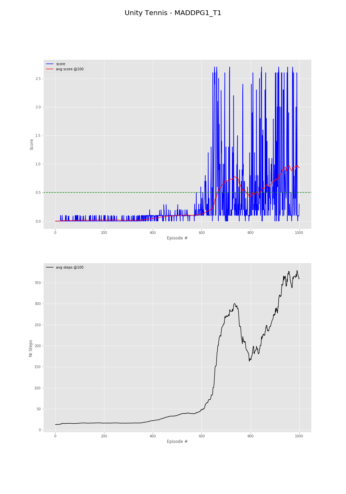

#  MADDPG implementation in PyTorch for the Unity Tennis environment

## Introduction

This implementation is based on a straight-forward Multi-Agent implementation of DDPG. We have two agents each with its own actor and critic (including the target networks for each) where each critic receives the combined state as well as combined actions.

## Implementation details

The modules are divided as follows:
 - `engine.py` contains the main Multi-Agent code including the creation of each individual agent actors and critics (online & target)
 - `agent.py` defines the basic behavior of individual agents without the actual training procedure
 - `brain.py` defines the graphs that are used for actors and critics
 - `ma_per.py` contains the replay buffer definition including the prioritized experience buffers (_work in progress_)
 - `OUNoise.py` contains the Ornstein–Uhlenbeck process noise generation class
 - `main.py` is the local version of the main code that can be used locally (without the Jupyter Notebook). Basically we have both the option of running locally the code with `main.py` as well as running the notebook `Tennis.ipynb`. This is basically where the Unity environment is created as well as the `MADDPGEngine` class is instantiated.
 
The overall Multi-Agent DDPG approach follows the proposed approach from _[Multi-Agent Actor-Critic for Mixed Cooperative-Competitive Environments](https://arxiv.org/abs/1706.02275)_. Basically, each of the two agents optimize their online critics and then use the critic direct output to perform gradient descent in the inverse direction of the critic's output.

The training pseudo-code that can be found in `MADDPGEngine.train()` can be summarized as:

```
  for each agent:
    both agents target actors computes next_action
    curernt agent target critic generates next q-value
    using current agent reward compute TD-error
    optimize current agent critic
    compute next action for all actors 
    compute q-value with current agent critic (using all actions and states)
    minimize q-value return wrt current agent actor parameters
  for each agent:
    slowly transfer weights from online to target graphs
```

The main loop for our experiment is also residing in `MADDPEngine` in the `run_on_unity` function and the actual pseudo-code is the following:

```
  for all proposed episodes
    reset env
    for all proposed steps
      determine actions and send to the env
      obtain env feedback on actions
      train if enough data is available    
    asses training progress      
```

### The grid-search

In order to find optimal solution we performed multi-step grid-search. The first grid-search dictionary has been defined with the following self-explanatory parameters:

```
  dct_grid = {
      "actor_layers" : [ 
              [128, 128],
            ],
      "critic_state_layers" : [
            [128],
          ],
      "critic_final_layers" : [
            [128],
          ],
      "actor_input_bn" : [True, False],
      "actor_hidden_bn" : [True, False],
      "critic_state_bn" : [True, False],
      "critic_final_bn" : [True, False],
      "apply_post_bn"   : [True, False],
      "noise_scaling_factor" : [2, 1],
      }
```

For the above grid-search a mini-framework has been developed consisting in a dictionary-to-iterations expander `grid_dict_to_values()` as well as a iteration parameters generator `grid_pos_to_params`. 
The dictionary contains the exact definition of the `MADDPGEngine` object initialization parameters.


>_*Important note*: the purpose of the grid-search was not to find a actual solution but to find a set of hyperparmeters that assure a very good convergence. That is why for the grid search procedure we only called the training method of the multi-agent engine once after each episode._


The initial graphs design has been simplified to a 3 hidden-layer for the actor (128-128-2) and a 128-units layer for the state featurization followed by another two layers (128-1) that receive the state features and the concatenated actions. This is a a considerable difference from the original DDPG architecture, described in [Continuous control with deep reinforcement learning](https://arxiv.org/abs/1509.02971), that specifies 400-300-2 for the actor and 400/400/200-200-1 for the critic.

The grid-search resulted in 64 iterations and best results have been obtained for:
 - `actor_hidden_bn=True`  : apply batch-norm after each hidden layer in actor graphs
 - `apply_post_bn=False`   : apply batch-norm before the non-linearity
 - `noise_scaling_factor=2`: start from a scaling factor of 2 for the Ornstein–Uhlenbeck noise generation and slowly decrease up to a 0.5x noise

```
  {'actor_input_bn': True,  'actor_hidden_bn': True, 'critic_state_bn': False, 'critic_final_bn': True,  'apply_post_bn': False, 'noise_scaling_factor': 2}
  {'actor_input_bn': True, ' actor_hidden_bn': True, 'critic_state_bn': True,  'critic_final_bn': False, 'apply_post_bn': True,  'noise_scaling_factor': 2}
  {'actor_input_bn': False, 'actor_hidden_bn': True, 'critic_state_bn': True,  'critic_final_bn': False, 'apply_post_bn': False, 'noise_scaling_factor': 2}
  {'actor_input_bn': False, 'actor_hidden_bn': True, 'critic_state_bn': True,  'critic_final_bn': False, 'apply_post_bn': False, 'noise_scaling_factor': 2}
  {'actor_input_bn': False, 'actor_hidden_bn': True, 'critic_state_bn': False, 'critic_final_bn': True,  'apply_post_bn': False, 'noise_scaling_factor': 1}
  {'actor_input_bn': False, 'actor_hidden_bn': True, 'critic_state_bn': False, 'critic_final_bn': True,  'apply_post_bn': False, 'noise_scaling_factor': 2} 
```

The second stage after narrowing the first set of parameters was to introduce `selu` and `elu` non-linearities as well as allow the noise to be generated from a Gaussian rather from the OU process. 
No improvement has been made over initial `relu` activation by using the new activations however the generation of gaussian noise yielded a big improvement in exploration as well as convergence speed.
Also the noise scaling of the generated noise has been tested: we start with a 2x scaling then we decrease with a 0.9999 factor per update. We found that a minimal value of 0.2 ensures less "exploration" at later stages and more solid convergence as oposed to a minimal noise scaling of 0.5.

### The final training

The final training was done with the following graphs architecture and following hyperparameters: 
For the actor graph:
```
MADDPGActor(
  (layers): ModuleList(
    (0): Linear(in_features=24, out_features=128, bias=True)
    (1): BatchNorm1d(128, eps=1e-05, momentum=0.1, affine=True, track_running_stats=True)
    (2): ReLU()
    (3): Linear(in_features=128, out_features=128, bias=True)
    (4): BatchNorm1d(128, eps=1e-05, momentum=0.1, affine=True, track_running_stats=True)
    (5): ReLU()
  )
  (final_linear): Linear(in_features=128, out_features=2, bias=True)
  (final_activation): Tanh()
)
```
For the critic graph:
```
MADDPGCritic(
  (final_layers): ModuleList(
    (0): Linear(in_features=132, out_features=128, bias=True)
    (1): ReLU()
  )
  (state_layers): ModuleList(
    (0): Linear(in_features=48, out_features=128, bias=True)
    (1): BatchNorm1d(128, eps=1e-05, momentum=0.1, affine=True, track_running_stats=True)
    (2): ReLU()
  )
  (final_linear): Linear(in_features=128, out_features=1, bias=True)
)
```
Following a no-training-warming-up of 4096 steps the training procedure is called by the environment loop each step.
The training could have been accelerated with a smart-sampling of the replay buffer that would drop buffers with extreme sparse results as well as increasing number of sampling-trainings per step from 1 to 2-3.
The final results for 1000 episodes is below:



In this chart we can see both the scores as required by the proposed environment "engagement rules" as well as maximum number of steps the agents are able to sustain each episode _(there is a obvious correlation between the average scores and the capacity to sustain up to 1000 steps of game-play)_

Also, we have below the training history where we can observe for each 100 episodes the following indicators: final score of the 100x series of episodes, the 100-running average score, the 100-running max, overall max score, the loaded buffer size, number of training updates, the noise scaling factors `nsf` and the 100-running mean steps per episode
```
Episode  100 score:0.000  avg:0.014  max100:0.100  max: 0.10  buff:   1701/20000  upd:     0  nsf:2.00  avg_stp: 16.0
Episode  200 score:0.100  avg:0.017  max100:0.100  max: 0.10  buff:   3467/20000  upd:     0  nsf:2.00  avg_stp: 16.7
Episode  300 score:0.100  avg:0.016  max100:0.100  max: 0.10  buff:   5221/20000  upd:  1318  nsf:1.75  avg_stp: 16.5
Episode  400 score:0.090  avg:0.046  max100:0.200  max: 0.20  buff:   7531/20000  upd:  3928  nsf:1.35  avg_stp: 22.1
Episode  500 score:0.200  avg:0.095  max100:0.290  max: 0.29  buff:  11124/20000  upd:  7821  nsf:0.91  avg_stp: 34.9
Episode  600 score:0.100  avg:0.126  max100:0.600  max: 0.60  buff:  15974/20000  upd: 12971  nsf:0.55  avg_stp: 47.5
Episode  666 score: 2.100,  avg:0.519,  nsf:0.20  steps:792     
Environment solved in 667 episodes!
Episode  700 score:1.300  avg:0.709  max100:2.700  max: 2.70  buff:  20000/20000  upd: 40530  nsf:0.20  avg_stp:271.6
Episode  800 score:0.300  avg:0.430  max100:2.700  max: 2.70  buff:  20000/20000  upd: 57598  nsf:0.20  avg_stp:166.7
Episode  900 score:0.000  avg:0.703  max100:2.700  max: 2.70  buff:  20000/20000  upd: 85422  nsf:0.20  avg_stp:274.2
Episode 1000 score:0.300  avg:0.936  max100:2.700  max: 2.70  buff:  20000/20000  upd:121792  nsf:0.20  avg_stp:359.7
```

### Saved results & testing

Multiple "final-training" iterations have been made resulting in multiple chart outputs (that can be found in `img/` folder) similar with the one above and also multiple saved models (`models/` folder). Within the local version of the experiment contained in the `main.py` file there is also a final procedure that runs the environment in testing mode using a couple of saved actors - _make sure you enable the testing with `RUN_TEST = True`_.

## Other improvements and next steps

Several improvements have been implementated such as:
- prioritized experience buffer (PER) that is based/updated using the TD-error generated by the individual critics (as we sample separate batches of experiences for each individual agent - see logs)
- huber vs mse loss (see logs)
- selective sampling based on reward sparsity - we track a variable called non-zero-replay-batch (`nzr`) that tells what percentage of the batch is non-sparse

We will also look into:
- _Combined Experience Replay_ as described by [A Deeper Look at Experience Replay](https://arxiv.org/pdf/1712.01275.pdf).
- [Hindsight Experience Replay](https://arxiv.org/abs/1707.01495)
- addition of second critic for each agent in order to implement the Q-value function aproximation improvement based on double targets as described in [Addressing Function Approximation Error in Actor-Critic Methods](https://arxiv.org/abs/1802.09477)

### Aditional results/logs

```
MADDPG4_huber_PER1:
	Ep  100 sc:0.000  avg:0.017  max100:0.100  buff:   1792/20000  upd:     0  nsf:2.00  avg_stp: 16.9  nzr: nan%
	Ep  200 sc:0.000  avg:0.023  max100:0.100  buff:   3697/20000  upd:     0  nsf:2.00  avg_stp: 18.1  nzr: nan%
	Ep  300 sc:0.000  avg:0.008  max100:0.100  buff:   5293/20000  upd:  1420  nsf:1.74  avg_stp: 15.0  nzr:10.6%
	Ep  400 sc:0.100  avg:0.031  max100:0.200  buff:   7421/20000  upd:  3848  nsf:1.36  avg_stp: 20.3  nzr: 7.7%
	Ep  500 sc:0.200  avg:0.089  max100:0.300  buff:  11182/20000  upd:  7909  nsf:0.91  avg_stp: 36.6  nzr: 6.9%
	Ep  600 sc:0.200  avg:0.146  max100:0.700  buff:  16952/20000  upd: 13979  nsf:0.49  avg_stp: 56.7  nzr: 6.5%
	Ep  700 sc:0.100  avg:0.240  max100:1.500  buff:  20000/20000  upd: 23885  nsf:0.20  avg_stp: 95.1  nzr: 6.4%
	Ep  800 sc:0.000  avg:0.213  max100:1.500  buff:  20000/20000  upd: 32360  nsf:0.20  avg_stp: 80.8  nzr: 6.4%
	Ep  900 sc:2.600  avg:0.351  max100:2.600  buff:  20000/20000  upd: 46685  nsf:0.20  avg_stp:139.2  nzr: 6.3%
	Ep  951  sc:1.800,  avg:0.513,  nsf:0.20,  steps:693,  nzr: 6.3%     
	Environment solved in 952-991 episodes! 
	Ep 1000 sc:1.700  avg:0.790  max100:2.700  buff:  20000/20000  upd: 77578  nsf:0.20  avg_stp:304.9  nzr: 6.4%


MADDPG4_mse_PER1
	Ep  100 sc:0.000  avg:0.018  max100:0.100  buff:   1767/20000  upd:     0  nsf:2.00  avg_stp: 16.7  nzr: nan%
	Ep  200 sc:0.100  avg:0.018  max100:0.200  buff:   3645/20000  upd:     0  nsf:2.00  avg_stp: 17.8  nzr: nan%
	Ep  300 sc:0.000  avg:0.013  max100:0.100  buff:   5310/20000  upd:  1443  nsf:1.73  avg_stp: 15.7  nzr: 9.4%
	Ep  400 sc:0.000  avg:0.034  max100:0.100  buff:   7359/20000  upd:  3792  nsf:1.37  avg_stp: 19.5  nzr: 7.1%
	Ep  500 sc:0.100  avg:0.120  max100:0.600  buff:  12183/20000  upd:  8916  nsf:0.82  avg_stp: 47.2  nzr: 6.2%
	Ep  600 sc:0.100  avg:0.208  max100:1.600  buff:  20000/20000  upd: 17115  nsf:0.36  avg_stp: 78.0  nzr: 5.9%
	Ep  672  sc:2.700,  avg:0.502,  nsf:0.20,  steps:1000,  nzr: 6.2%    
	Environment solved in 632-673 episodes!
	Ep  700 sc:0.900  avg:0.616  max100:2.700  buff:  20000/20000  upd: 41006  nsf:0.20  avg_stp:234.9  nzr: 6.3%
	Ep  800 sc:0.100  avg:0.634  max100:2.700  buff:  20000/20000  upd: 65757  nsf:0.20  avg_stp:243.5  nzr: 6.6%
	Ep  900 sc:0.300  avg:0.570  max100:2.700  buff:  20000/20000  upd: 88327  nsf:0.20  avg_stp:221.7  nzr: 6.7%
	Ep 1000 sc:2.600  avg:0.532  max100:2.600  buff:  20000/20000  upd:108973  nsf:0.20  avg_stp:202.5  nzr: 6.5%
	
	
MADDPG4_huber_none:
	Ep  100 sc:0.000  avg:0.022  max100:0.100  buff:   1845/20000  upd:     0  nsf:2.00  avg_stp: 17.4  nzr: nan%
	Ep  200 sc:0.090  avg:0.026  max100:0.200  buff:   3871/20000  upd:     0  nsf:2.00  avg_stp: 19.3  nzr: nan%
	Ep  300 sc:0.000  avg:0.013  max100:0.100  buff:   5619/20000  upd:  1797  nsf:1.67  avg_stp: 16.5  nzr: 3.3%
	Ep  400 sc:0.100  avg:0.055  max100:0.200  buff:   8253/20000  upd:  4731  nsf:1.25  avg_stp: 25.3  nzr: 3.3%
	Ep  500 sc:0.200  avg:0.089  max100:0.300  buff:  12217/20000  upd:  8995  nsf:0.81  avg_stp: 38.6  nzr: 3.2%
	Ep  600 sc:0.200  avg:0.196  max100:1.100  buff:  19855/20000  upd: 16933  nsf:0.37  avg_stp: 75.4  nzr: 3.2%
	Ep  630  sc:2.600,  avg:0.508,  nsf:0.20,  steps:1000,  nzr: 3.0%    
	Environment solved in 631-653 episodes!
	Ep  700 sc:0.300  avg:0.758  max100:2.700  buff:  20000/20000  upd: 46627  nsf:0.20  avg_stp:292.9  nzr: 2.9%
	Ep  800 sc:0.300  avg:0.643  max100:2.700  buff:  20000/20000  upd: 72043  nsf:0.20  avg_stp:250.2  nzr: 2.8%
	Ep  900 sc:1.000  avg:0.753  max100:2.700  buff:  20000/20000  upd:101236  nsf:0.20  avg_stp:287.9  nzr: 2.8%
	Ep 1000 sc:1.090  avg:0.744  max100:2.700  buff:  20000/20000  upd:130449  nsf:0.20  avg_stp:288.1  nzr: 2.7%
	
MADDPG4_mse_none:	
	Ep  100 sc:0.000  avg:0.018  max100:0.100  buff:   1868/20000  upd:     0  nsf:2.00  avg_stp: 17.7  nzr: nan%
	Ep  200 sc:0.000  avg:0.023  max100:0.200  buff:   3730/20000  upd:     0  nsf:2.00  avg_stp: 17.6  nzr: nan%
	Ep  300 sc:0.000  avg:0.008  max100:0.100  buff:   5339/20000  upd:  1487  nsf:1.72  avg_stp: 15.1  nzr: 3.3%
	Ep  400 sc:0.090  avg:0.044  max100:0.200  buff:   7710/20000  upd:  4158  nsf:1.32  avg_stp: 22.7  nzr: 3.3%
	Ep  500 sc:0.100  avg:0.094  max100:0.300  buff:  11400/20000  upd:  8148  nsf:0.89  avg_stp: 35.9  nzr: 3.3%
	Ep  600 sc:0.500  avg:0.168  max100:0.700  buff:  17943/20000  upd: 14991  nsf:0.45  avg_stp: 64.4  nzr: 3.2%
	Ep  678  sc:1.000,  avg:0.500,  nsf:0.20,  steps:381,  nzr: 3.0%     
	Environment solved in 679 episodes!
	Ep  700 sc:0.200  avg:0.563  max100:2.700  buff:  20000/20000  upd: 36994  nsf:0.20  avg_stp:216.0  nzr: 3.0%
	Ep  800 sc:0.500  avg:0.452  max100:2.600  buff:  20000/20000  upd: 55074  nsf:0.20  avg_stp:176.8  nzr: 2.9%
	Ep  900 sc:1.300  avg:0.643  max100:2.600  buff:  20000/20000  upd: 80433  nsf:0.20  avg_stp:249.6  nzr: 2.8%
	Ep 1000 sc:0.000  avg:0.754  max100:2.600  buff:  20000/20000  upd:110157  nsf:0.20  avg_stp:293.2  nzr: 2.8%
```